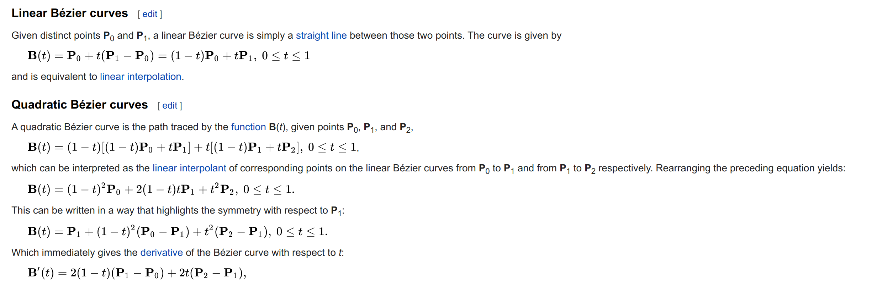
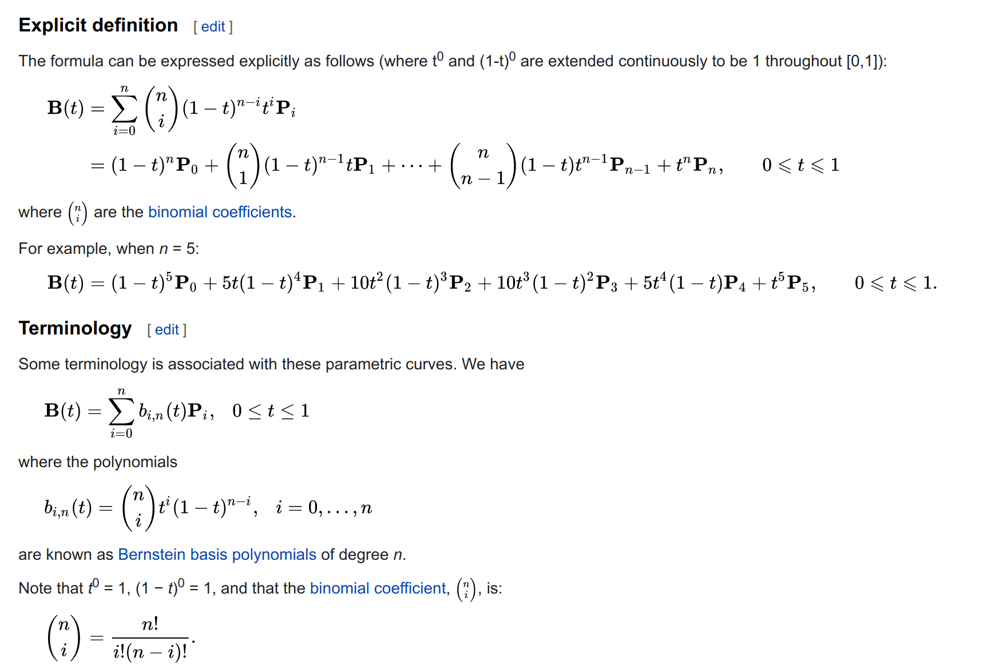
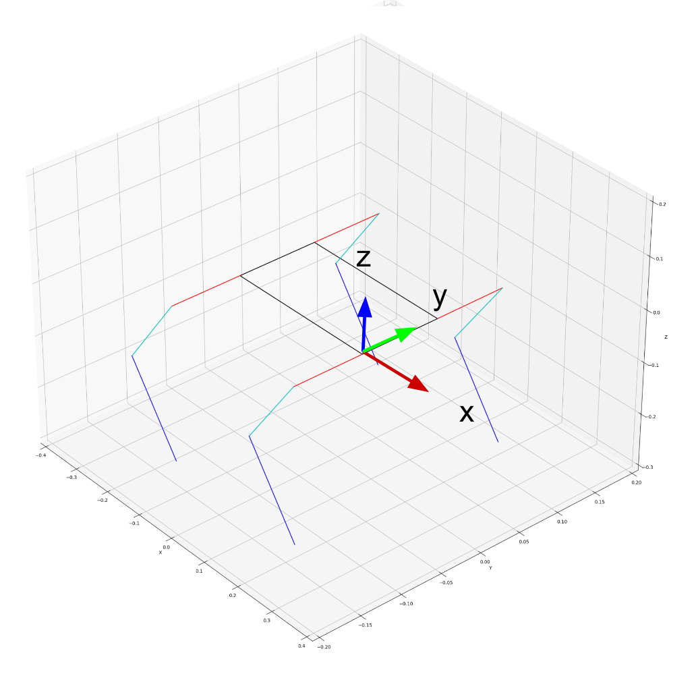

# quadrupped_robot_plotter
Quadrupped Robot Matplotlib Plotter for Inverse/Forward Kinematics

original work from 

## Setup Guide

```powershell
git clone https://github.com/Road-Balance/quadrupped_robot_plotter.git

cd quadrupped_robot_plotter
python3 -m venv .venv

<activate venv>

# Linux
./.venv/bin/activate
# Windows
.\.venv\Scripts\Activate.ps1

# install requirements
(.venv) > pip install -r requirements.txt

```

## Run

```
python plot_animation.py
```

# Notepad

<p>
    
</p>


<p>
    
</p>

<p>
    
</p>